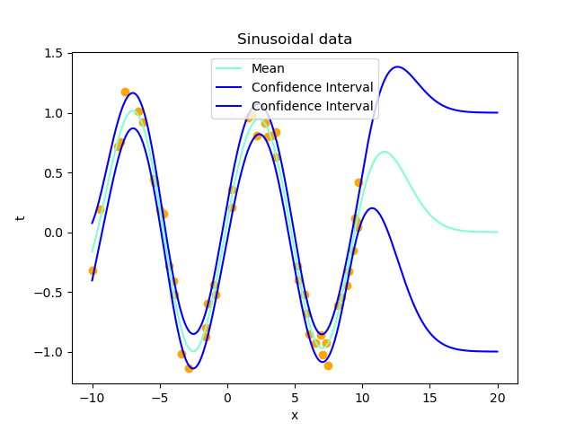

# Bayesian Model Selection for Gaussian Processes

This repository contains the code for Bayesian model selection for Gaussian Process using maximum evidence.
In this repository, we will use the squared exponential kernel with only one parameter (RBF form)



## How to run the code
1) Install the Python modules in ```requirements.txt```
2) Run the Jupyter Notebook